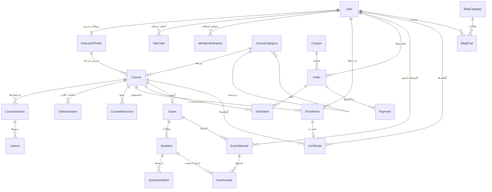

# معماری پروژه آکادمی HSE

این سند تصویر کلی پروژه است: چه چیزی می‌سازیم، چرا این‌طور می‌سازیم، و دیتابیس
چه شکلی دارد. قبل از شروع هر فاز، بخش مربوط به آن را در این سند بخوانید.

---

## ۱. تصمیم معماری کلان

پروژه یک **Monolith یکپارچه با Django** است: یک برنامه، یک دیتابیس، یک سرور.

**چرا Microservices نه؟** میکروسرویس مشکلِ «تیم‌های بزرگ و ترافیک خیلی زیاد» را حل
می‌کند، نه مشکل ما را. برای یک تیم کوچک و یک MVP چهل‌روزه، میکروسرویس فقط پیچیدگی
استقرار، دیباگ و هزینه سرور را چند برابر می‌کند. یک Monolith تمیز با مرزبندی
درست بین اپ‌ها، بعداً هر وقت لازم شد قابل تفکیک است.

**چرا Django Templates و نه React؟** با Django Templates صفحات در سمت سرور رندر
می‌شوند (Server Side Rendering) و این برای سئو بهترین حالت است — و سئو یکی از
نیازهای اصلی این پروژه است. ضمناً حذف React یعنی حذف Node.js، حذف Build Process
و اجرای سبک روی سیستم شما.

### تفکیک فیزیکی سرویس‌ها

با اینکه برنامه یکپارچه است، **فایل‌های سنگین روی سرور اصلی نمی‌مانند**:

```
┌────────────────────────┐      ┌──────────────────────┐
│   سرور اصلی Django     │      │  سرور فایل / دانلود  │
│                        │      │                      │
│ • سایت و پنل مدیریت    │      │ • ویدیوهای ضبط‌شده   │
│ • دیتابیس PostgreSQL   │─────▶│ • PDFهای حجیم        │
│ • داشبورد دانشجو       │ لینک │ • منابع دوره         │
│ • پرداخت و ثبت‌نام     │      │                      │
│ • آزمون و گواهی        │      └──────────────────────┘
└───────────┬────────────┘
            │ لینک جلسه
            ▼
   ┌──────────────────┐
   │ اسکای‌روم (کلاس) │
   └──────────────────┘
```

دیتابیس فقط **آدرس** فایل را نگه می‌دارد، نه خود فایل. کنترل دسترسی هم در سطح
Django انجام می‌شود: کاربری که ثبت‌نام معتبر ندارد، اصلاً آدرس را در HTML نمی‌بیند.

> **محدودیتی که باید بدانید:** اگر کسی لینک را کپی کند و به دیگری بدهد، آن لینک
> مستقیماً قابل استفاده است. راه‌حل کامل، لینک امضاشده و موقت (Signed URL) است که
> در نسخه دوم اضافه می‌شود. برای MVP، پنهان‌کردن لینک از افراد بدون ثبت‌نام کافی است.

---

## ۲. ساختار اپلیکیشن‌ها

هر اپ یک «حوزه کاری» مستقل است. مرز اپ‌ها را طوری کشیده‌ایم که وابستگی‌ها یک‌طرفه
بمانند و بعداً بتوان هر بخش را جدا تغییر داد.

| اپ | مسئولیت |
|---|---|
| `apps.core` | صفحات عمومی، تنظیمات سایت، بنر، سؤالات متداول، تماس با ما، همکاران |
| `apps.accounts` | کاربر، نقش‌ها، OTP، احراز هویت، پروفایل مدرس و دانشجو |
| `apps.courses` | دسته‌بندی، دوره، سرفصل، درس، جلسه آنلاین، منابع |
| `apps.enrollments` | ثبت‌نام در دوره و پیشرفت دانشجو |
| `apps.payments` | سفارش، پرداخت، کد تخفیف، اتصال به درگاه |
| `apps.exams` | آزمون، سؤال، گزینه، تلاش، پاسخ کاربر |
| `apps.certificates` | صدور گواهی، PDF، QR، استعلام عمومی |
| `apps.blog` | مقاله و خبر (زیرساخت آماده، انتشار در نسخه بعد) |

**در فاز ۱ فقط `core` و `accounts` ساخته شده‌اند.** بقیه در فاز مربوط به خودشان
اضافه می‌شوند.

### لایه سرویس (Service Layer)

هر جا با «دنیای بیرون» حرف می‌زنیم، منطق را داخل View نمی‌نویسیم. یک کلاس سرویس
با رابط مشخص می‌سازیم و پیاده‌سازی واقعی/آزمایشی را پشت آن عوض می‌کنیم:

| سرویس | نقش | پیاده‌سازی‌ها |
|---|---|---|
| `SmsService` | ارسال پیامک | `MockSmsProvider` · `KavenegarProvider` |
| `NationalIdentityService` | تطبیق موبایل و کد ملی | `MockIdentityProvider` · `ShahkarProvider` |
| `PaymentGateway` | درگاه پرداخت | `MockGateway` · `ZarinpalGateway` |
| `SkyroomService` | کلاس آنلاین | `ManualLinkProvider` · `SkyroomApiProvider` |

**چرا این‌طور؟** شما هنوز تصمیم نگرفته‌اید کدام سرویس استعلام هویت را بخرید. با این
ساختار می‌توانید کل سایت را با نسخه Mock بسازید و تست کنید، و روزی که سرویس واقعی
را خریدید، فقط **یک فایل** اضافه می‌کنید — نه یک خط از Viewها و مدل‌ها تغییر می‌کند.

---

## ۳. طراحی دیتابیس

### نمودار روابط



### توضیح روابط کلیدی

**کاربر و پروفایل‌ها.** یک مدل `User` داریم با فیلد `role`. اطلاعات اضافی مدرس
(بیوگرافی، عکس، تخصص) در `InstructorProfile` جدا نگه داشته می‌شود؛ چون فقط بخش
کوچکی از کاربران مدرس‌اند و بی‌دلیل جدول کاربران را سنگین نمی‌کنیم.

**دوره و محتوا.** `Course → CourseSection → Lesson` یک زنجیره سه‌سطحی است، دقیقاً
مثل فهرست یک کتاب: دوره، فصل، درس. `OnlineSession` مستقیماً به `Course` وصل است نه
به `Lesson`، چون جلسه آنلاین یک رویداد زمان‌دار است و در ساختار فصل‌ها نمی‌گنجد.

**ثبت‌نام؛ قلب کنترل دسترسی.** `Enrollment` تنها مدرکی است که ثابت می‌کند کاربر
حق دیدن محتوای دوره را دارد. روی `(user, course)` قید یکتایی می‌گذاریم تا هیچ‌وقت
دو ثبت‌نام تکراری ساخته نشود — این همان چیزی است که جلوی «دو بار فعال‌شدن دوره با
یک پرداخت» را می‌گیرد.

**سفارش و پرداخت جدا هستند.** یک `Order` می‌تواند چند `Payment` داشته باشد، چون
کاربر ممکن است بار اول پرداخت ناموفق داشته باشد و دوباره تلاش کند. سابقه همه
تلاش‌ها باید بماند. `Enrollment` **فقط** بعد از تأیید سمت‌سرور پرداخت ساخته می‌شود.

**آزمون.** `ExamAttempt` هر بار شرکت در آزمون را ثبت می‌کند و `UserAnswer` تک‌تک
پاسخ‌ها را. نمره را در `ExamAttempt` ذخیره می‌کنیم (نه اینکه هر بار محاسبه کنیم)
تا اگر بعداً سؤالی ویرایش شد، نمره قبلی دانشجو تغییر نکند.

**گواهی.** `Certificate` به کاربر و دوره وصل است و یک `certificate_code` یکتا و
یک توکن تصادفی برای استعلام دارد. **کد گواهی و توکن استعلام دو چیز جدا هستند:**
کد برای نمایش به کاربر است، توکن برای لینک QR — تا کسی نتواند با حدس‌زدن کدهای
پشت‌سرهم، گواهی دیگران را استخراج کند.

---

## ۴. جریان‌های اصلی سیستم

### ثبت‌نام و احراز هویت

```
موبایل → ارسال OTP → تأیید OTP → گرفتن کد ملی → استعلام تطبیق → حساب فعال
```

نکته امنیتی: کد OTP **هرگز** خام ذخیره نمی‌شود؛ فقط هش آن در دیتابیس می‌ماند،
دقیقاً مثل رمز عبور. محدودیت زمانی، محدودیت تعداد تلاش و محدودیت ارسال مجدد هم
از ابتدا اعمال می‌شود.

### خرید دوره

```
انتخاب دوره → ساخت Order → درخواست پرداخت → درگاه بانک
   → بازگشت به سایت (Callback) → تأیید سمت‌سرور → ثبت‌نام فعال می‌شود
```

**مهم‌ترین قانون امنیتی این پروژه:** هیچ‌وقت به اطلاعات داخل آدرس بازگشتی از درگاه
اعتماد نمی‌کنیم. کاربر می‌تواند آدرس مرورگر را دستکاری کند و بنویسد «پرداخت موفق
بود». تنها چیزی که معتبر است، پاسخ مستقیم سرور ما به سرور درگاه در مرحله Verify
است. دوره فقط و فقط بعد از آن تأیید فعال می‌شود.

### صدور گواهی

```
تکمیل دوره (+ قبولی در آزمون در صورت نیاز)
   → ساخت Certificate → تولید PDF با QR → قابل استعلام در صفحه عمومی
```

---

## ۵. تغییراتی که نسبت به طرح اولیه پیشنهاد کرده‌ام

طرح شما کامل و درست بود. سه تغییر کوچک برای رسیدن مطمئن به MVP چهل‌روزه:

**۱. مدل کاربر سفارشی به فاز ۱ منتقل شد.** در طرح شما این کار در فاز ۳ بود. اما
Django بعد از اولین `migrate` اجازه تعویض راحت مدل کاربر را نمی‌دهد؛ این کار یا
پاک‌کردن کل دیتابیس می‌خواهد یا Migration دستی و دردسرساز. پس مدل کاربر را **قبل
از اولین migrate** ساختیم. فرم‌ها و صفحات ورود و ثبت‌نام همچنان در فاز ۳ می‌آیند.

**۲. آزمون تشریحی فعلاً پیاده‌سازی نمی‌شود.** فیلد `question_type` را از ابتدا در
مدل می‌گذاریم و معماری آماده است، اما در نسخه اول فقط سؤال چندگزینه‌ای پیاده می‌شود.
سؤال تشریحی نیاز به رابط تصحیح دستی برای مدرس دارد که کار جداگانه‌ای است.

**۳. پنل اختصاصی مدرس در نسخه اول ساخته نمی‌شود.** به‌جای ساختن یک پنل جداگانه،
از خودِ Django Admin با دسترسی محدود استفاده می‌کنیم: مدرس وارد پنل می‌شود اما فقط
دوره‌های خودش را می‌بیند. این ۹۰٪ نیاز را با ۱۰٪ زمان پوشش می‌دهد. پنل اختصاصی
با ظاهر سایت، کار نسخه دوم است.

هیچ‌کدام از نیازهای کاری شما حذف نشده است — فقط ترتیب و عمق پیاده‌سازی تنظیم شده.

---

## ۶. قواعد ثابت پروژه

این قواعد در تمام فازها رعایت می‌شوند:

**امنیت.** هیچ کلید و رمزی داخل کد نوشته نمی‌شود؛ همه از `.env`. رمز عبور و کد OTP
همیشه هش می‌شوند. هر Viewی که محتوای خریداری‌شده نشان می‌دهد، اول ثبت‌نام کاربر را
بررسی می‌کند. در Production مقدار `DEBUG` حتماً `False` است.

**لاگ.** پرداخت، ورود، OTP، استعلام هویت و صدور گواهی لاگ می‌شوند — اما **هرگز**
کد OTP خام، رمز عبور یا اطلاعات کارت بانکی داخل لاگ نمی‌رود.

**پیام خطا.** کاربر هیچ‌وقت خطای خام فنی نمی‌بیند. به‌جای `HTTP 500` پیام فارسی و
قابل فهم نمایش داده می‌شود؛ جزئیات فنی فقط در لاگ سرور ثبت می‌شود.

**استقلال از اینترنت خارجی.** تمام فونت‌ها، CSS، JS و آیکون‌ها محلی هستند. هیچ CDN
خارجی در مسیر بحرانی سایت قرار نمی‌گیرد.

**سئو.** تمام صفحات عمومی سمت سرور رندر می‌شوند، آدرس‌ها معنادار و فارسی‌فهم‌اند،
و هر صفحه عنوان و توضیحات اختصاصی خودش را دارد.
